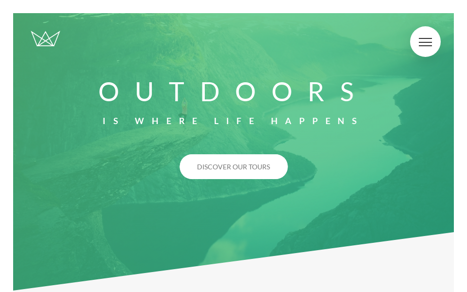
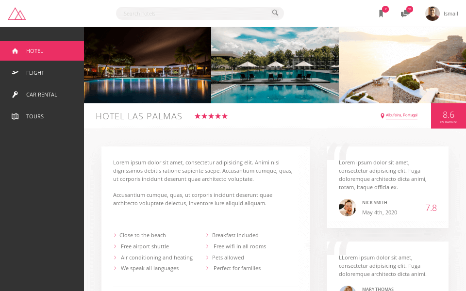

All projects are built and served with Netlify

# Projects

<h2 align="center">
  Natours
</h2>

<h2 align="center">
  

  :eyes: [Vist project demo](https://natours.ismaaa.me)
</h2>

#### Folder
:file_folder: `projects/Natours`

#### Deployments
https://app.netlify.com/sites/natours-ismaaa/deploys

---
<h2 align="center">
  Trillo
</h2>

<h2 align="center">
  

  :eyes: [Vist project demo](https://trillo.ismaaa.me)
</h2>

#### Folder
:file_folder: `projects/Trillo`

#### Deployments
https://app.netlify.com/sites/trillo-ismaaa/deploys