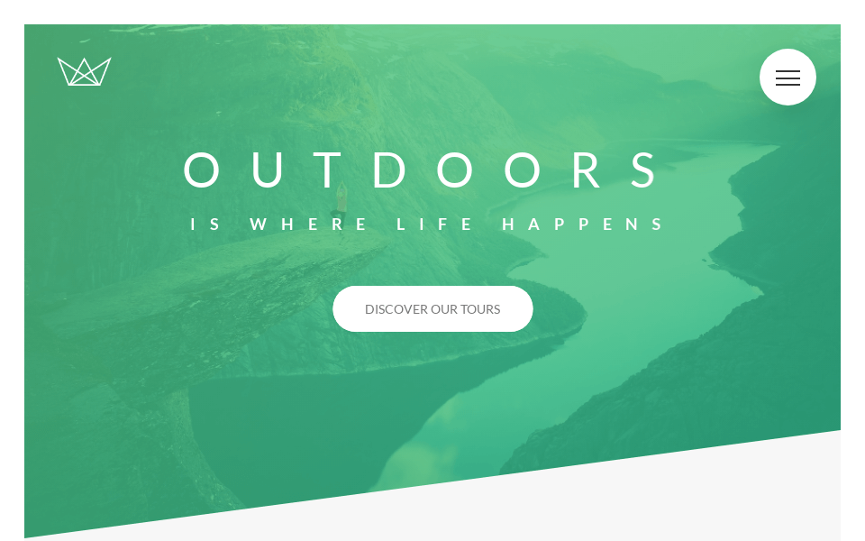

# Projects

<h2 align="center">
  Natours
</h2>

<h2 align="center">
  

  :eyes: [Vist project demo](https://natours.ismaaa.me)
</h2>

<!-- TODO: Add used technologies -->

#### Folder
:file_folder: `projects/Natours`
<!-- 
### Build status
 -->

---
<h2 align="center">
  Trillo (soon...)
</h2>

#### Folder
:file_folder: `projects/Trillo`