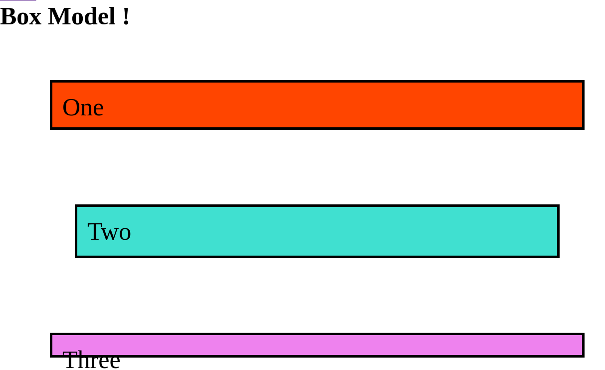

# Takeaways
* The height of an element is always the sum of height, padding and border.
* The margin property will always take the greatest when it collapses when another element
* Padding for spacing element from itself
* Margin for spacing element from another element
* box-sizing: border-box will take only the element height and it won't perfom any sum of the padding and border

